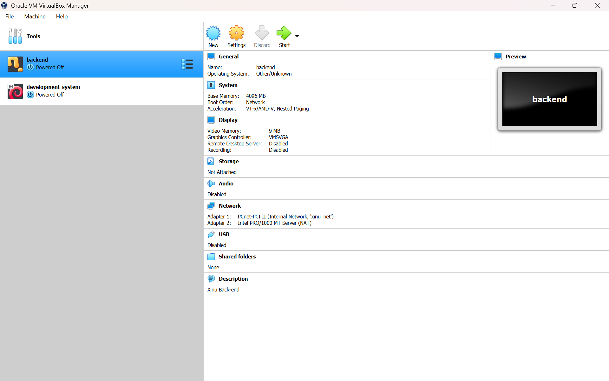
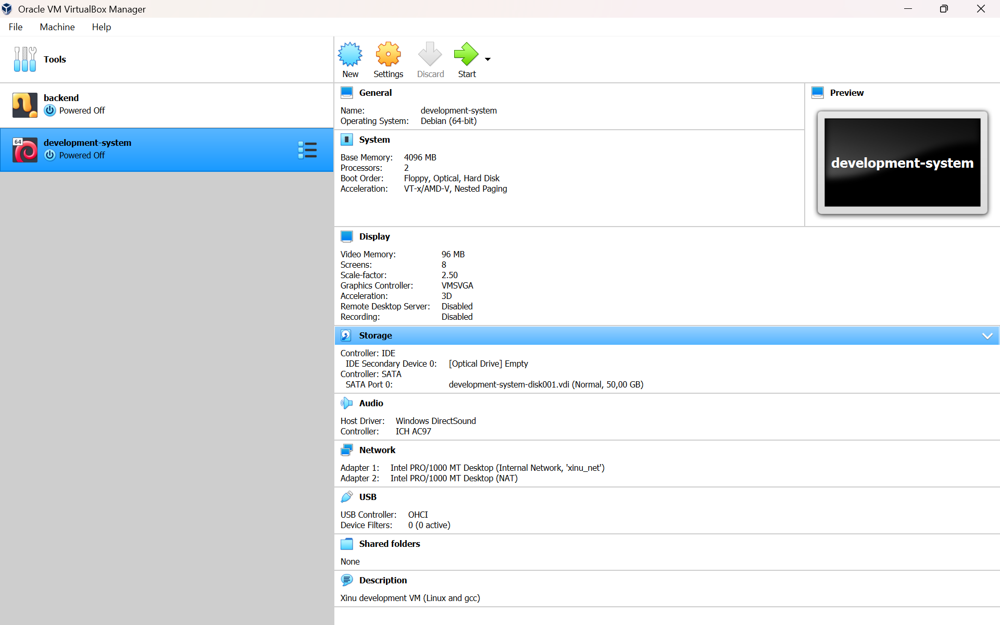

# <h1 align="center">Laporan Praktikum Modul 2   Instalasi Xinu</h1>

Muhammad Fathi Rafa - 2311104022

## Dasar Teori

Xinu OS adalah OS kecil dan elegan yang dikhususkan 
untuk lingkungan embedded seperti smartphone atau mp3 player. Paradigma yang sering 
digunakan untuk pengembangan embedded system adalah programmer menggunakan tool 
umum (editor, compiler, linker, dll) untuk membuat Xinu OS image. Xinu image tersebut kemudian 
akan diload pada target komputer. Target komputer kemudian booting Xinu OS. Arsitektur yang 
digunakan adalah sebagai berikut ini:

## Guided

screenshot running VirtualBox dan Sourcetrail.

screenshot setting backend

screenshot setting development system

## Modul 2
TUGAS MODUL 2
Intaslasi Xinu
1. Buka modul untuk langkah-langkah instalasi xinu. Lalu setting ulang dengan mengikuti aturan berikut
Rename development-system menjadi NIM - development-system

Rename backend menjadi NIM – backend

Ganti serial port pada development system dan backend menjadi\.\pipe\NIM_com

Ganti password development system. Ikuti tutorial berikut Tutorial Ubah Password

   
2. Jalankan development-system, backend, dan sourcetrail hingga berhasil

## Referensi

1. https://en.wikipedia.org/wiki/Data_structure 
2. Modul Praktikum Sistem Operasi