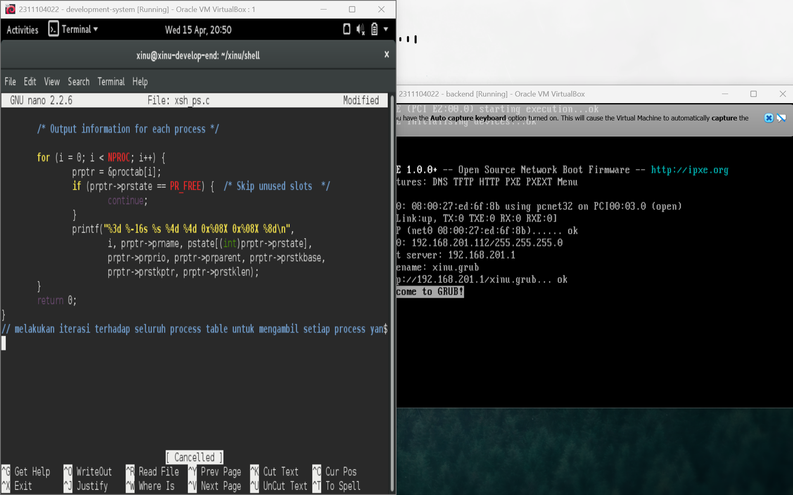
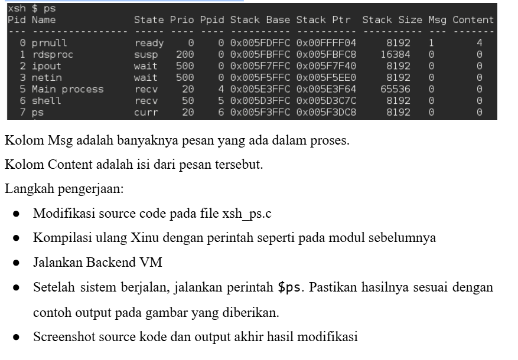
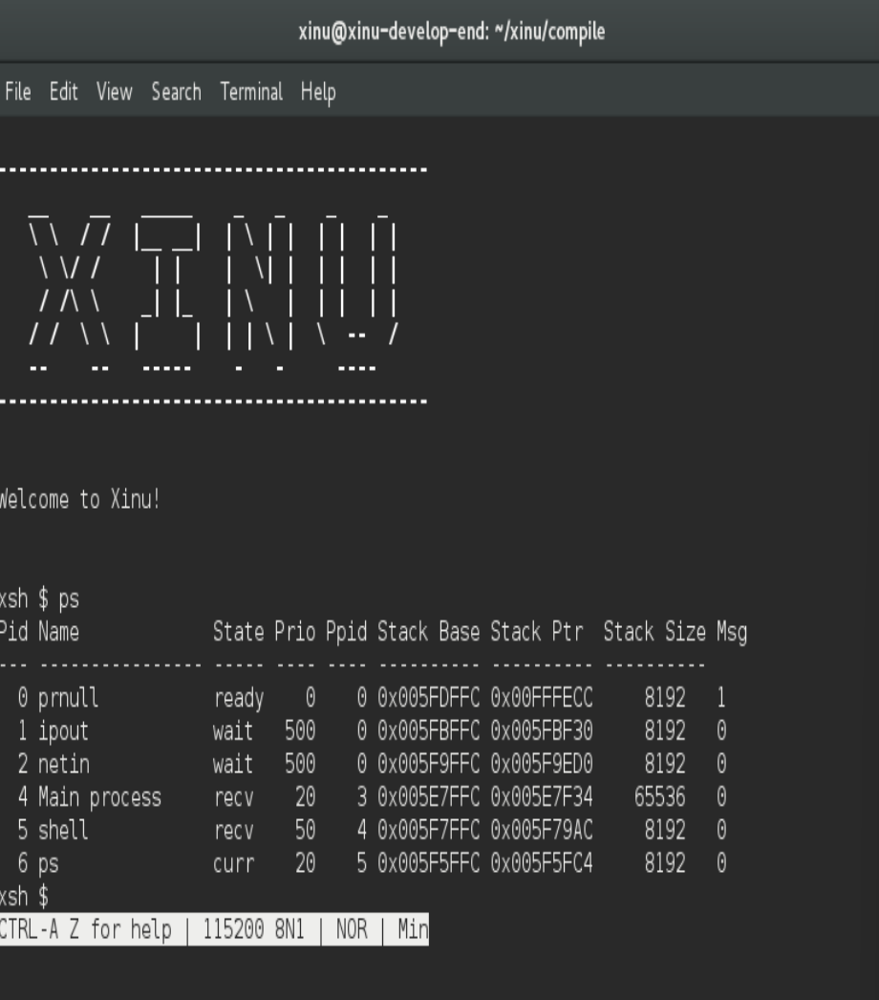
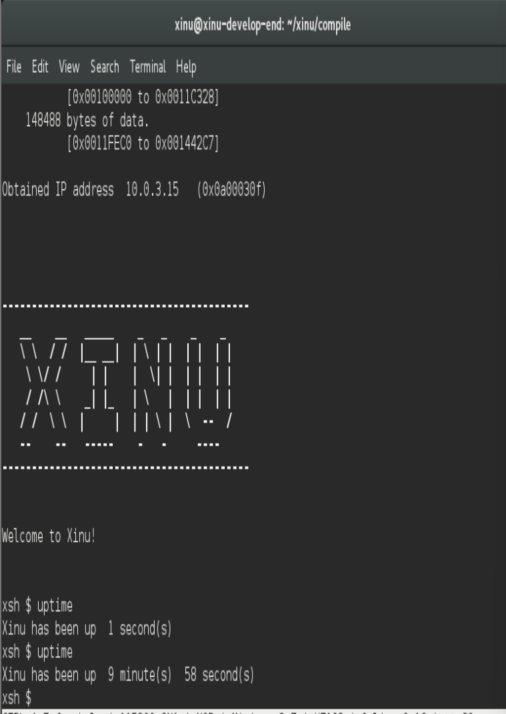

# <h1 align="center">Laporan Praktikum Modul 5  Eksplorasi Proses</h1>

Muhammad Fathi Rafa - 2311104022

## Dasar Teori

Sistem operasi menyimpan semua informasi mengenai semua proses yang berjalan pada struktur 
data yang disebut sebagai process table. Sebuah proses direpresentasikan sebagai sebuah entri 
dalam process table tersebut. Entri pada process table akan dibuat pada saat proses diciptakan 
dan entri pada process table akan dihapus pada saat proses diterminasi.

## Guided

## Jurnal
1. [10 Poin] Jawablah pertanyaan berikut ini: 
    a. Berapa banyaknya maksimum proses yang ada pada Xinu?
    = 50 proses
    b. Berapa maksimal panjang nama suatu proses pada Xinu?
    = 16 karakter (termasuk null terminator)
    c. Berapa nilai prioritas awal pada saat proses dibuat?
    = saat paki create(), default priority biasanya: 20
    d. Ada berapa total state pada Xinu? Sebutkan!
    = 7 state

2. [20 Poin] Perintah ps adalah perintah untuk menampilkan statistik process yang berjalan. Source code dari ps tersimpan pada file xsh_ps.c. Carilah file tersebut dan beri komentar pada 20 baris terakhir di source code tersebut!
=

3. [35 Poin] Ubahlah perintah ps (source code: xsh_ps.c) pada Xinu sehingga menampilkan informasi tambahan berupa kolom yang berisi total message yang ada pada proses seperti gambar di bawah ini:

=

4. [35 Poin] Ubahlah perintah uptime pada Xinu sehingga menampilkan lamanya Xinu sejak booting hanya dalam satuan menit.
    Langkah pengerjaan:
    - Modifikasi source code pada file xsh_uptime.c
    - Kompilasi ulang Xinu dengan perintah seperti pada modul sebelumnya 
    - Jalankan Backend VM 
    - Setelah sistem berjalan, jalankan perintah $uptime. Pastikan hasilnya sesuai dengan contoh output yang diinginkan
    - Screenshot source kode dan output akhir hasil modifikasi
=

## Referensi
1. https://en.wikipedia.org/wiki/Data_structure 
2. Modul Praktikum Sistem Operasi