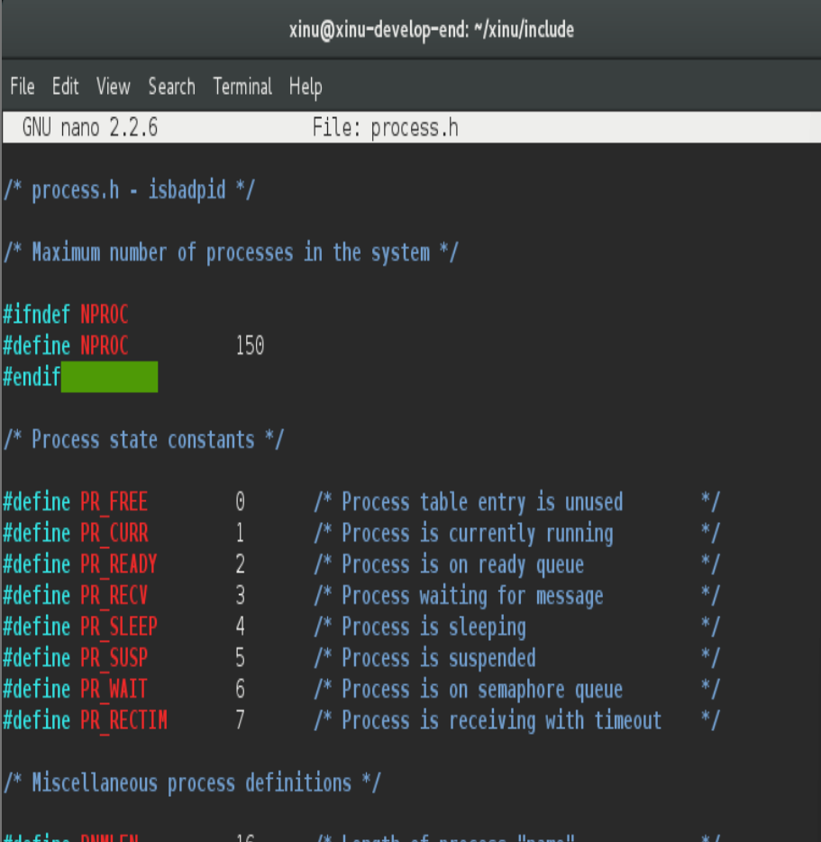
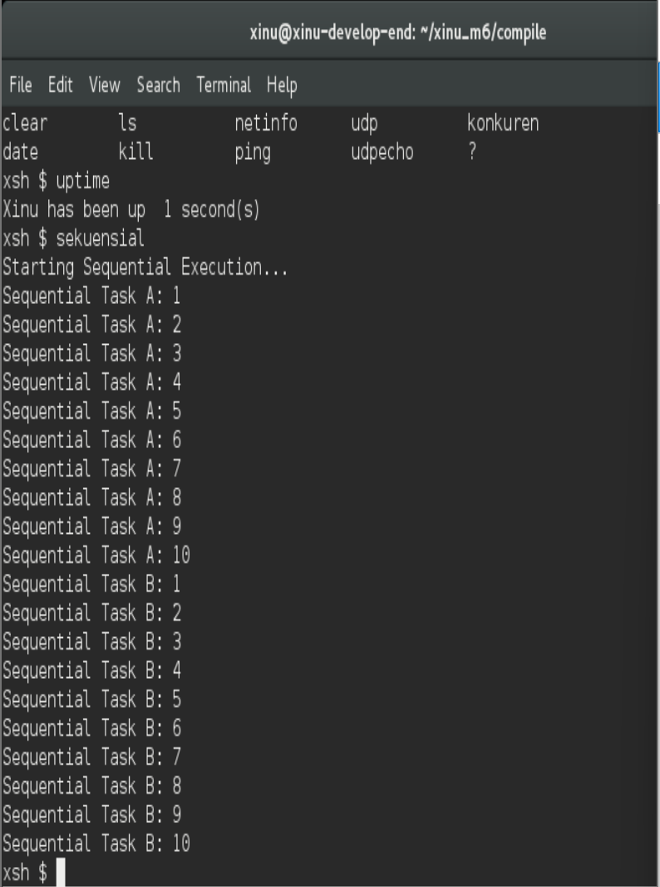
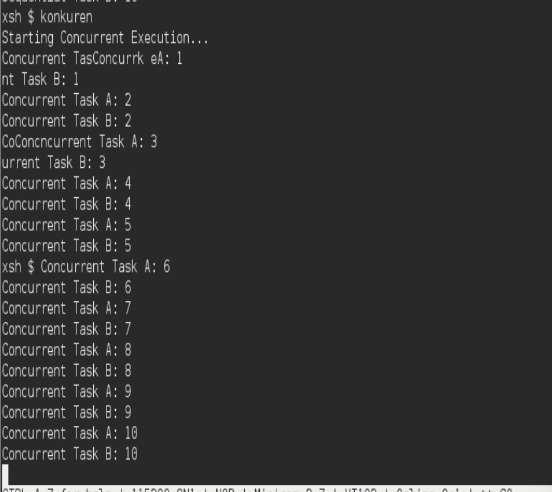
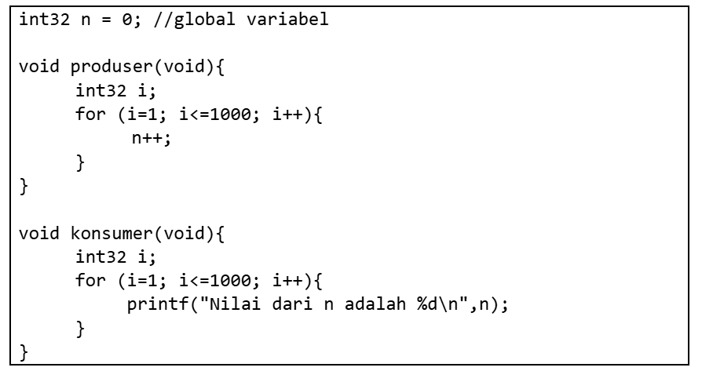
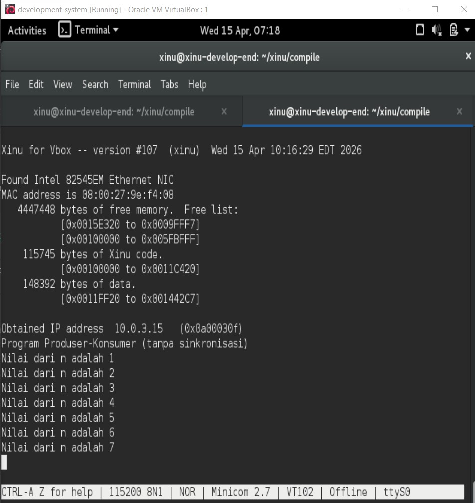

# <h1 align="center">Laporan Praktikum Modul 6   Sekuensial dan Konkuren</h1>

Muhammad Fathi Rafa - 2311104022

## Dasar Teori

1. Secara intuisi, ketika program berjalan, programmer membayangkan komputer akan melakukan 
eksekusi kode baris per baris, statement per statement. Pada setiap waktu komputer hanya 
mengeksekusi sebuah statement. Cara pandang tersebut disebut sebagai sekuensial.
2. Sistem operasi memperluas pandangan mengenai komputasi dengan konsep concurrent 
processing. Concurrent processing berarti banyak komputasi dapat berlangsung “pada saat yang 
bersamaan”. Catatan: pada komputer dengan banyak core atau cpu, komputer benar-benar dapat 
melakukan banyak hal secara bersamaan (parallelism). Pada komputer dengan 1 CPU maka OS 
akan menciptakan ilusi konkurensi.
3. Untuk menciptakan ilusi “berjalan pada saat yang bersamaan”, komputer menggunakan teknik 
yang disebut multiprogramming/multitasking/interleaving yaitu sistem operasi memilih proses 
yang ada dari kumpulan proses yang tersedia, mengeksekusi proses tersebut, memilih proses lain 
dan kemudian mengkesekusinya. Komputer akan mengkesekusi satu proses dalam beberapa 
millisecond kemudian berpindah ke proses lainnya. Ketika dilihat oleh manusia, tampak bahwa 
semua proses berjalan bersamaan karena cepatnya prosesor dan lambatnya indera manusia.
4. Terdapat 2 kategori multitasking yaitu: timesharing dan realtime. Timesharing memberikan 
prioritas yang sama untuk setiap komputasi, memperbolehkan komputasi berjalan dan berakhir 
sesuai dengan durasi yang telah ditentukan saja. Realtime memberikan prioritas yang berbeda 
untuk setiap komputasi karena terdapat performansi waktu yang ingin dicapai. Realtime akan 
memberikan prioritas dan menjadwalkan proses secara terencana.

## Guided

## Jurnal
1. [10 Poin] Selain hardware (memory), batasan maksimal proses dapat ditentukan dengan secara software.  Pada Linux maksimal proses adalah 4194303 proses (64 bit) dan 32767 proses (32 bit) dapat dilihat melalui perintah $cat /proc/sys/kernel/pid_max 

Carilah pada source code Xinu yang memberi batasan mengenai banyaknya proses yang bisa dibuat! Berapa maksimal proses dalam Xinu?  Ubah menjadi maksimal 150 proses! 
=

2. [20 Poin] Jalankan kode sekuensial! 
=

3.  [20 Poin] Jalankan kode konkuren! 
=

4. [50 Poin] Buatlah 2 proses produser dan konsumer. Produser memproduksi angka integer dari 1-1000. Konsumer mengkonsumsi integer yang diproduksi oleh produser dan menampilkannya! (Gunakan variabel global bertipe int32 bernama n yang digunakan secara bersama oleh kedua proses)

Hasil dari program ini cukup mengejutkan (tidak akan sesuai dengan intuisi awal). Jelaskan mengapa hasilnya seperti itu!

## Referensi
1. https://en.wikipedia.org/wiki/Data_structure 
2. Modul Praktikum Sistem Operasi