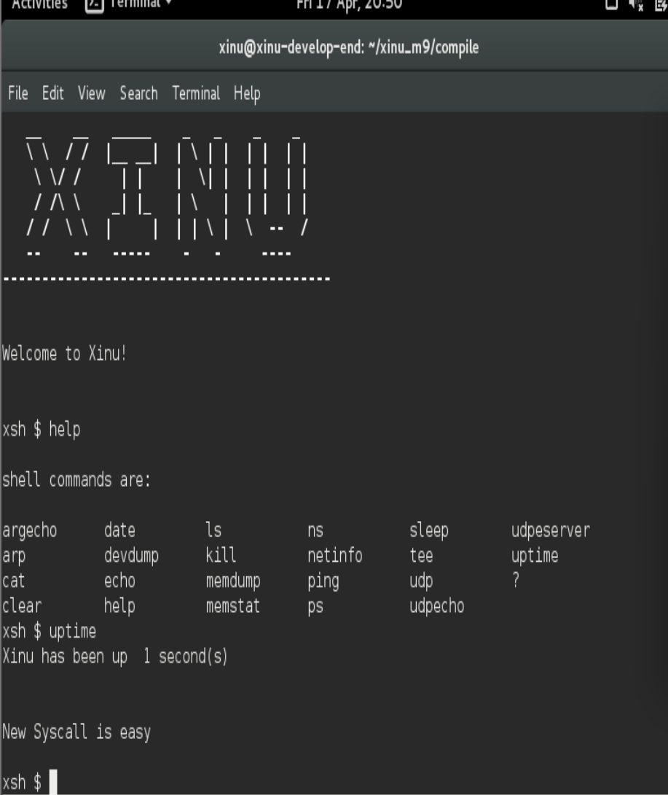
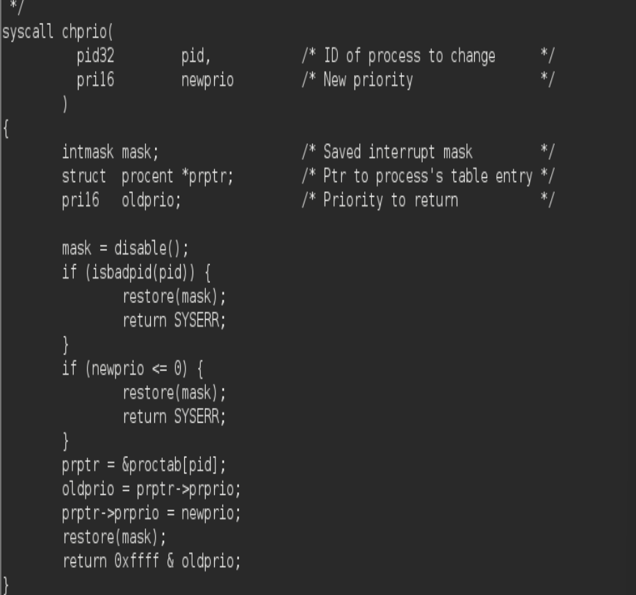
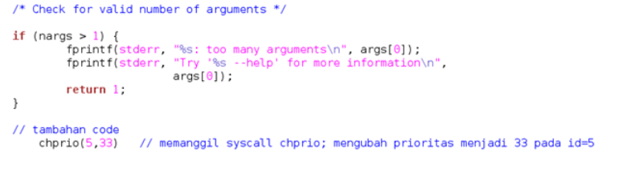
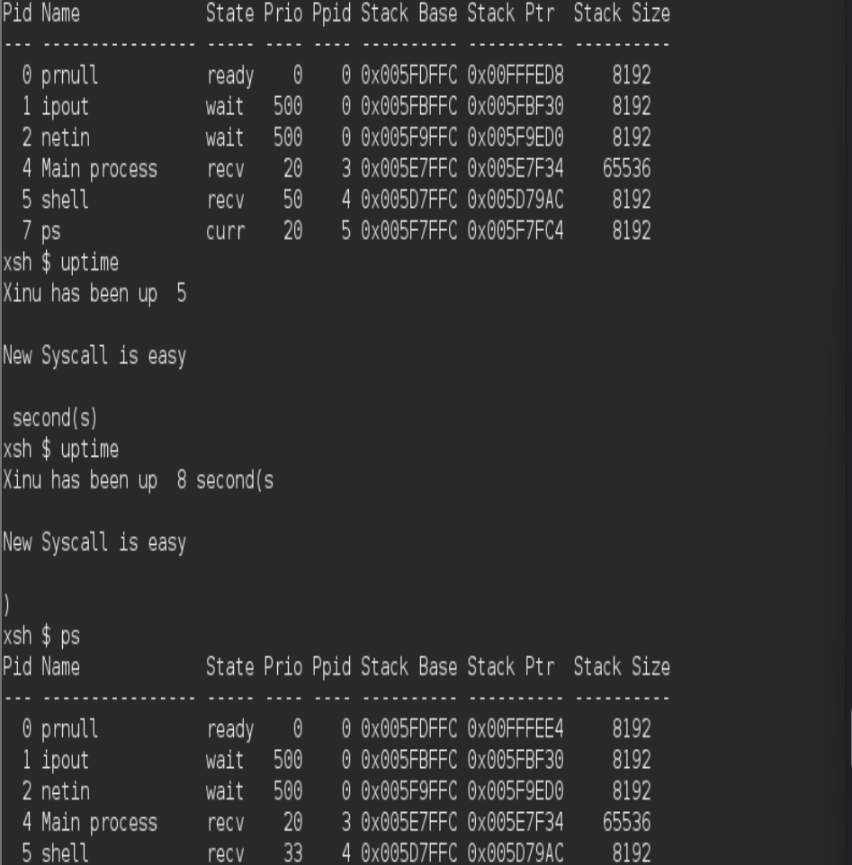
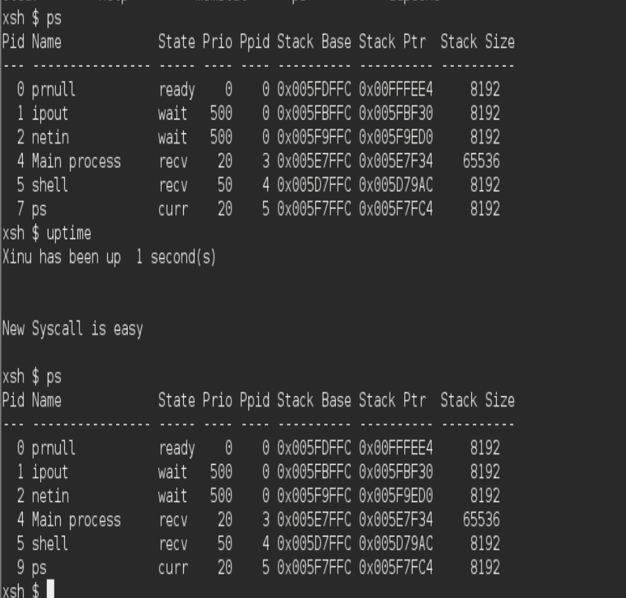
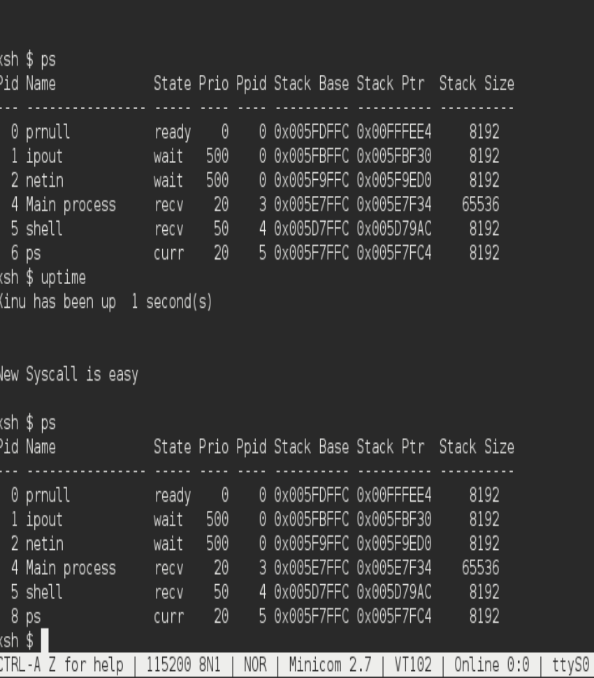

# <h1 align="center">Laporan Praktikum Modul 9   Syscall Xinu</h1>

Muhammad Fathi Rafa - 2311104022

## Dasar Teori

Syscall didefinisikan sebagai interface layanan yang diberikan oleh sistem operasi. Proses akan 
menggunakan syscall jika ingin mendapatkan layanan dari os. Selain itu, syscall juga memberikan 
lapisan perlindungan keamanan dan information hiding. Proses tidak perlu mengetahui detail internal 
syscall. Proses cukup memanggil syscall yang diinginkan, kernel os akan mengeksekusinya dan proses 
menerima hasilnya (berhasil atau gagal syscall tersebut). Syscall berbeda dengan fungsi yang dibuat 
oleh developer misal fungsi printf()

## Guided

## Jurnal
1. [50 Poin] Buat syscall baru seperti yang ditunjukkan pada modul syscall poin 9.5! (sertakan Screenshot kode dan hasil run)

2. [25 Poin] Perbaiki syscall chprio (xinu/system/chprio.c) dengan memperhatikan validasi input 
Pastikan id adalah angka dari 0 – NPROC (ukuran maks banyaknya proses)
Pastikan prioritas adalah bilangan yang positif

Compile dan jalankan Xinu dengan syscall yang telah diperbaiki
make clean
make
=

3. Lakukan hal-hal berikut ini
Edit xsh_uptime.c
Tambahkan kode berikut

Compile source code tersebut dengan perintah
make clean
make
Jalankan perintah ps
xsh $ ps
perhatikan prioritas proses dengan id = 5 
Jalankan uptime 
xsh $ uptime
Perhatikan hasil perintah tersebut
Jalankan ps
xsh $ ps
perhatikan prioritas proses dengan id = 5 seharusnya sudah berubah

[25 Poin] Testing chprio syscall yang telah diubah
Testing prioritas tidak boleh < 0: Ubah “chprio(5,33)” menjadi “chprio(5,-3)” pada xsh_uptime.c
Testing id adalah valid: Ubah “chprio(5,33)” menjadi “chprio(3000,3)”
Hasil dua testing di atas adalah prioritas tidak berubah karena salah argument (dibuktikan dengan menggunakan perintah ps)
=
yang 5,33 

yang 5,-3 hasilnya tetep 50

yang 3000,3

hasilnya tetep tidak berubah, tidak seperti file pada xsh_uptime yang 5,33
## Referensi
1. https://en.wikipedia.org/wiki/Data_structure 
2. Modul Praktikum Sistem Operasi