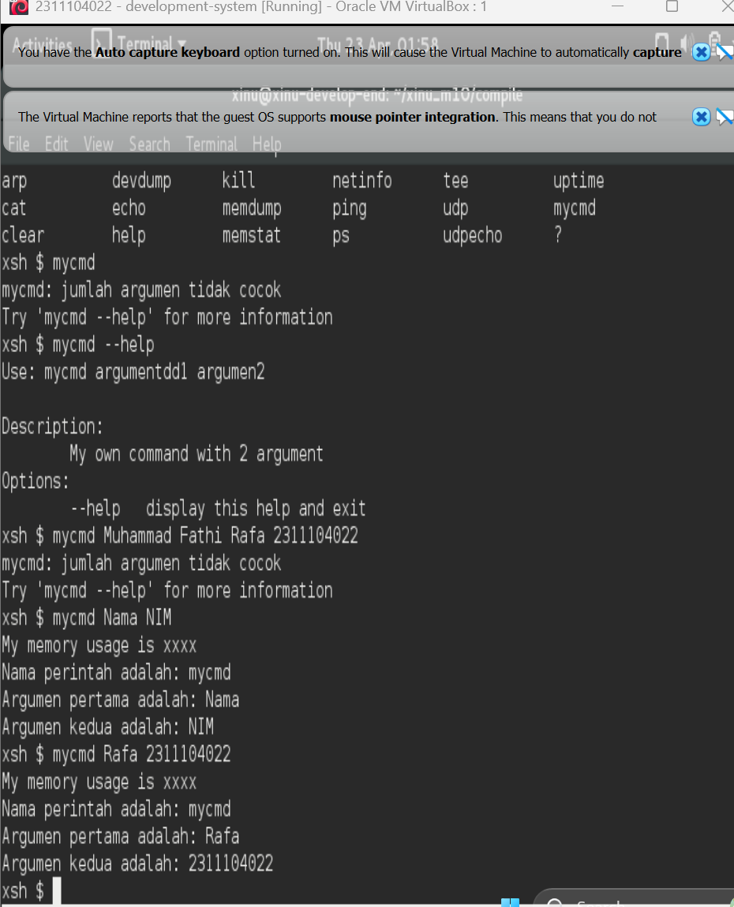

# <h1 align="center">Laporan Praktikum Modul 10   Shell</h1>

Muhammad Fathi Rafa - 2311104022

## Dasar Teori

Pada modul sebelumnya telah dijelaskan mengenai syscall (layanan yang disediakan oleh sistem operasi). Akan tetapi, user normal tidak akan pernah/jarang mengakses syscall secara langsung.Biasanya user mengakses aplikasi dan aplikasi tersebut yang akan mengakses syscall.

Shell adalah program yang memproses perintah yang diberikan oleh user pada terminal. Shell akan looping secara terus menerus membaca baris input yang diberikan. Setelah sebuah baris input dibaca ditandai dengan adanya ENTER, shell harus mengekstrak nama perintah, argumen dan hal-hal lainnya. Jika proses ektraksi berhasil maka perintah akan dieksekusi sesuai dengan argumen yang diberikan

## Guided

## Jurnal

## Referensi
1. https://en.wikipedia.org/wiki/Data_structure 
2. Modul Praktikum Sistem Operasi